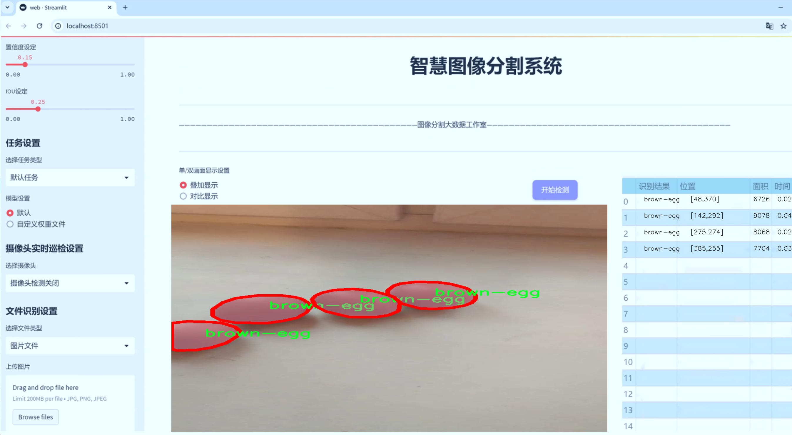
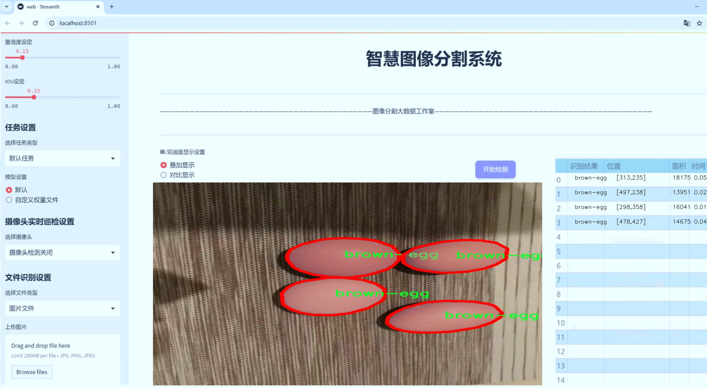
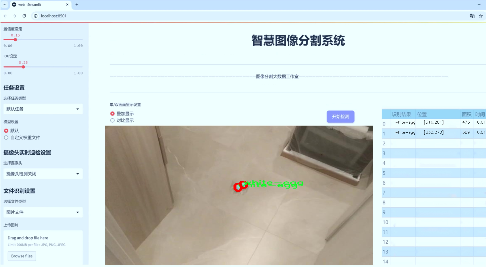
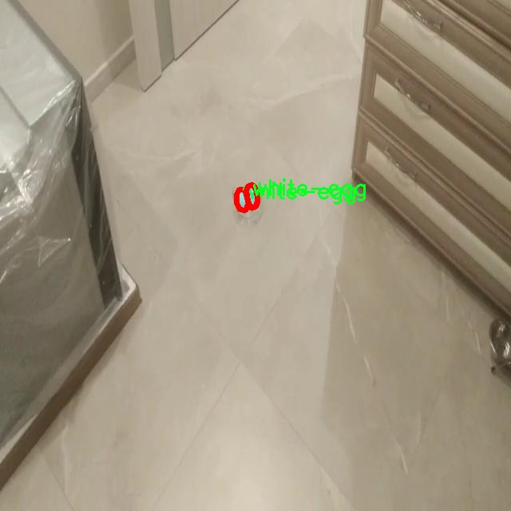
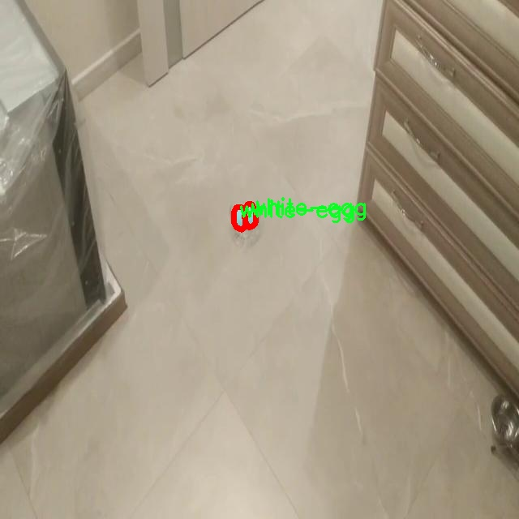
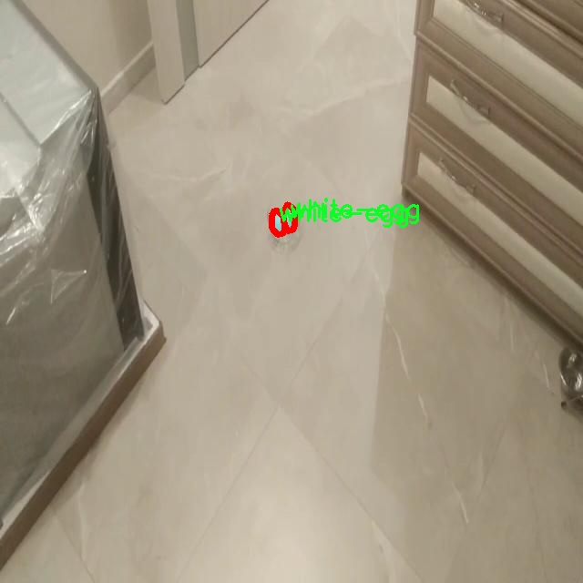
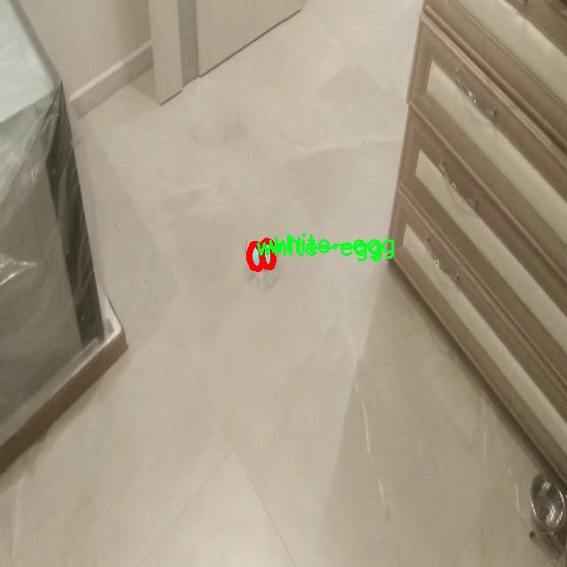
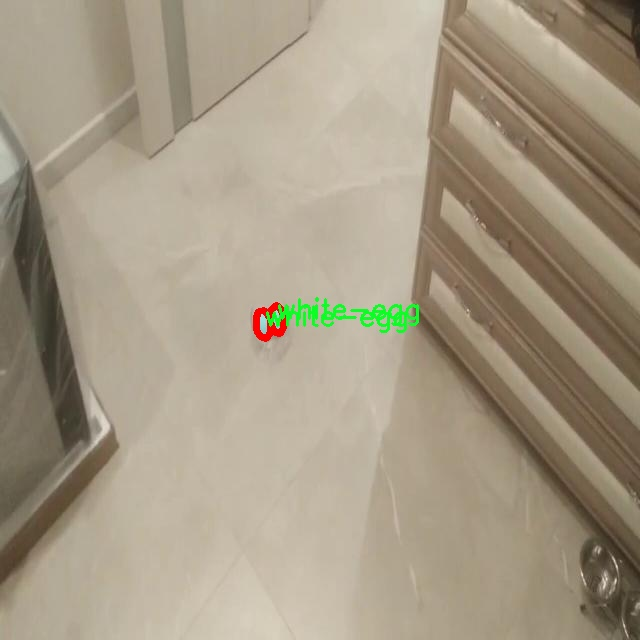

# 鸡蛋表面缺陷分割系统源码＆数据集分享
 [yolov8-seg-p6＆yolov8-seg等50+全套改进创新点发刊_一键训练教程_Web前端展示]

### 1.研究背景与意义

项目参考[ILSVRC ImageNet Large Scale Visual Recognition Challenge](https://gitee.com/YOLOv8_YOLOv11_Segmentation_Studio/projects)

项目来源[AAAI Global Al lnnovation Contest](https://kdocs.cn/l/cszuIiCKVNis)

研究背景与意义

随着全球食品安全和质量标准的不断提高，农业产品的检测与分级技术日益受到重视。鸡蛋作为一种重要的蛋白质来源，其质量直接影响到消费者的健康和食品安全。因此，开发高效、准确的鸡蛋表面缺陷检测系统具有重要的现实意义。传统的人工检测方法不仅耗时耗力，而且容易受到人为因素的影响，导致检测结果的不一致性。近年来，计算机视觉和深度学习技术的迅猛发展为这一问题提供了新的解决方案，尤其是基于卷积神经网络（CNN）的目标检测和分割技术，展现出了优越的性能。

在众多目标检测算法中，YOLO（You Only Look Once）系列算法因其高效性和实时性而备受关注。YOLOv8作为该系列的最新版本，进一步提升了检测精度和速度，适用于复杂环境下的物体检测任务。然而，针对鸡蛋表面缺陷的特定需求，YOLOv8仍需进行一定的改进，以适应多样化的缺陷类型和复杂的背景环境。基于此，本文提出了一种改进的YOLOv8模型，旨在实现鸡蛋表面缺陷的精准分割。

本研究所使用的数据集“eggs14”包含5000张图像，涵盖了六类鸡蛋表面缺陷，包括脏污的棕色鸡蛋、裂纹的棕色鸡蛋、白色鸡蛋、裂纹的白色鸡蛋以及脏污的白色鸡蛋。这些数据不仅提供了丰富的样本量，还涵盖了多种常见的缺陷类型，具有较高的代表性。通过对这些图像进行标注和分类，研究者能够更好地训练和评估改进后的YOLOv8模型，确保其在实际应用中的有效性和可靠性。

本研究的意义在于，通过改进YOLOv8模型，提升鸡蛋表面缺陷的检测和分割能力，不仅可以提高检测效率，降低人工成本，还能为鸡蛋生产企业提供科学的质量控制依据，确保产品符合市场标准。此外，该系统的成功应用将为其他农产品的缺陷检测提供借鉴，推动智能农业的发展。

综上所述，基于改进YOLOv8的鸡蛋表面缺陷分割系统的研究，不仅具有重要的理论价值，还具有广泛的应用前景。通过深入探讨和解决鸡蛋表面缺陷检测中的关键技术问题，本文将为实现农业生产的智能化、自动化提供新的思路和方法，促进食品安全和质量管理的进一步提升。

### 2.图片演示







##### 注意：由于此博客编辑较早，上面“2.图片演示”和“3.视频演示”展示的系统图片或者视频可能为老版本，新版本在老版本的基础上升级如下：（实际效果以升级的新版本为准）

  （1）适配了YOLOV8的“目标检测”模型和“实例分割”模型，通过加载相应的权重（.pt）文件即可自适应加载模型。

  （2）支持“图片识别”、“视频识别”、“摄像头实时识别”三种识别模式。

  （3）支持“图片识别”、“视频识别”、“摄像头实时识别”三种识别结果保存导出，解决手动导出（容易卡顿出现爆内存）存在的问题，识别完自动保存结果并导出到tempDir中。

  （4）支持Web前端系统中的标题、背景图等自定义修改，后面提供修改教程。

  另外本项目提供训练的数据集和训练教程,暂不提供权重文件（best.pt）,需要您按照教程进行训练后实现图片演示和Web前端界面演示的效果。

### 3.视频演示

[3.1 视频演示](https://www.bilibili.com/video/BV14cSEYfE9V/)

### 4.数据集信息展示

##### 4.1 本项目数据集详细数据（类别数＆类别名）

nc: 6
names: ['brow-egg-dirty', 'brown-egg', 'brown-egg-crack', 'white-egg', 'white-egg-crack', 'white-egg-dirty']


##### 4.2 本项目数据集信息介绍

数据集信息展示

在本研究中，我们使用了名为“eggs14”的数据集，旨在训练和改进YOLOv8-seg模型，以实现对鸡蛋表面缺陷的高效分割。该数据集专门针对鸡蛋的不同类型及其表面缺陷进行了详细标注，涵盖了六个主要类别，分别为：brow-egg-dirty（脏棕色鸡蛋）、brown-egg（棕色鸡蛋）、brown-egg-crack（裂纹棕色鸡蛋）、white-egg（白色鸡蛋）、white-egg-crack（裂纹白色鸡蛋）和white-egg-dirty（脏白色鸡蛋）。这些类别的选择不仅考虑了鸡蛋的颜色差异，还涵盖了不同的表面缺陷，旨在为鸡蛋质量检测提供全面的视觉信息。

数据集中的每个类别都经过精细的标注，以确保模型在训练过程中能够准确识别和分割不同类型的鸡蛋及其缺陷。例如，脏棕色鸡蛋和脏白色鸡蛋的标注，能够帮助模型学习到如何区分表面污垢对鸡蛋外观的影响，而裂纹鸡蛋的标注则提供了对鸡蛋完整性的重要判断依据。这种多样化的类别设置，使得模型在面对实际应用场景时，能够更好地适应不同的鸡蛋表面特征。

在数据集的构建过程中，研究团队注重数据的多样性和代表性，确保所收集的样本能够覆盖不同的环境、光照条件以及拍摄角度。这种全面的样本收集策略，不仅提高了数据集的有效性，也为后续的模型训练提供了丰富的学习素材。通过使用多样化的图像数据，YOLOv8-seg模型能够更好地学习到鸡蛋表面缺陷的特征，从而在实际应用中实现更高的准确率和鲁棒性。

此外，数据集的规模也是影响模型训练效果的重要因素。eggs14数据集包含了大量的图像样本，确保了模型在训练过程中能够获得足够的特征信息。这种大规模的数据支持，使得模型在学习过程中能够更好地捕捉到细微的差异，从而提高对鸡蛋表面缺陷的识别能力。

在模型训练的过程中，我们采用了数据增强技术，以进一步提升模型的泛化能力。通过对原始图像进行旋转、缩放、翻转等操作，生成更多的训练样本，使得模型能够在不同的情况下保持较高的识别精度。这种方法不仅丰富了训练数据集的多样性，也增强了模型对未知数据的适应能力。

综上所述，eggs14数据集为本研究提供了一个全面、丰富的基础，涵盖了鸡蛋表面缺陷的多种类型和特征。通过对该数据集的深入分析和利用，我们期望能够有效提升YOLOv8-seg模型在鸡蛋表面缺陷分割任务中的表现，为鸡蛋质量检测领域的自动化和智能化发展贡献力量。











### 5.全套项目环境部署视频教程（零基础手把手教学）

[5.1 环境部署教程链接（零基础手把手教学）](https://www.bilibili.com/video/BV1jG4Ve4E9t/?vd_source=bc9aec86d164b67a7004b996143742dc)


[5.2 安装Python虚拟环境创建和依赖库安装视频教程链接（零基础手把手教学）](https://www.bilibili.com/video/BV1nA4VeYEze/?vd_source=bc9aec86d164b67a7004b996143742dc)

### 6.手把手YOLOV8-seg训练视频教程（零基础小白有手就能学会）

[6.1 手把手YOLOV8-seg训练视频教程（零基础小白有手就能学会）](https://www.bilibili.com/video/BV1cA4VeYETe/?vd_source=bc9aec86d164b67a7004b996143742dc)


按照上面的训练视频教程链接加载项目提供的数据集，运行train.py即可开始训练



     Epoch   gpu_mem       box       obj       cls    labels  img_size
     1/200     0G   0.01576   0.01955  0.007536        22      1280: 100%|██████████| 849/849 [14:42<00:00,  1.04s/it]
               Class     Images     Labels          P          R     mAP@.5 mAP@.5:.95: 100%|██████████| 213/213 [01:14<00:00,  2.87it/s]
                 all       3395      17314      0.994      0.957      0.0957      0.0843

     Epoch   gpu_mem       box       obj       cls    labels  img_size
     2/200     0G   0.01578   0.01923  0.007006        22      1280: 100%|██████████| 849/849 [14:44<00:00,  1.04s/it]
               Class     Images     Labels          P          R     mAP@.5 mAP@.5:.95: 100%|██████████| 213/213 [01:12<00:00,  2.95it/s]
                 all       3395      17314      0.996      0.956      0.0957      0.0845

     Epoch   gpu_mem       box       obj       cls    labels  img_size
     3/200     0G   0.01561    0.0191  0.006895        27      1280: 100%|██████████| 849/849 [10:56<00:00,  1.29it/s]
               Class     Images     Labels          P          R     mAP@.5 mAP@.5:.95: 100%|███████   | 187/213 [00:52<00:00,  4.04it/s]
                 all       3395      17314      0.996      0.957      0.0957      0.0845


### 7.50+种全套YOLOV8-seg创新点代码加载调参视频教程（一键加载写好的改进模型的配置文件）

[7.1 50+种全套YOLOV8-seg创新点代码加载调参视频教程（一键加载写好的改进模型的配置文件）](https://www.bilibili.com/video/BV1Hw4VePEXv/?vd_source=bc9aec86d164b67a7004b996143742dc)

### 8.YOLOV8-seg图像分割算法原理

原始YOLOV8-seg算法原理

YOLOv8-seg是2023年由Ultralytics推出的一款先进的目标检测与分割模型，它在YOLO系列的基础上进行了多项创新和改进，旨在实现更高效的实时检测和分割任务。YOLOv8的设计理念是将多种前沿技术相结合，充分利用了YOLO系列之前版本的成功经验，尤其是YOLOv5、YOLOX、YOLOv6、YOLOv7和PP-YOLOE等算法的优势，形成了一个高效、精确且灵活的检测框架。

YOLOv8-seg的网络结构由四个主要部分组成：输入端、骨干网络、颈部网络和头部网络。输入端负责数据的预处理，包括马赛克增强、自适应锚框计算和自适应灰度填充等。这些预处理步骤旨在提高模型的鲁棒性和泛化能力，使其能够在多样化的环境中进行有效的目标检测与分割。

在骨干网络部分，YOLOv8采用了C2f模块和SPPF（Spatial Pyramid Pooling Fusion）结构。C2f模块的设计灵感来源于YOLOv7的ELAN结构，通过增加分支和跨层连接，增强了梯度流的丰富性，从而提升了特征表示能力。这一模块不仅提高了特征提取的效率，还增强了模型对复杂场景的适应能力。SPPF结构则通过多尺度特征融合，进一步提升了模型对不同尺寸目标的检测能力。

颈部网络采用了路径聚合网络（PAN）结构，旨在加强不同尺度特征的融合。PAN结构通过自底向上的特征传递，结合自顶向下的特征聚合，有效地整合了来自不同层次的特征信息。这种设计使得YOLOv8-seg能够在处理多尺度目标时，保持较高的精度和速度。

头部网络是YOLOv8-seg的核心部分，它将分类和检测过程进行了有效的解耦。通过引入Task-Aligned Assigner策略，YOLOv8-seg在正负样本的分配上进行了优化。该策略根据分类与回归的分数加权结果，选择最优的正样本进行训练，从而提升了模型的学习效率。损失计算过程涵盖了分类和回归两个分支，其中分类分支采用了二元交叉熵损失（BCELoss），而回归分支则结合了分布焦点损失（DFLoss）和完全交并比损失函数（CIOULoss），以提高边界框预测的准确性。

与之前的YOLO版本相比，YOLOv8-seg在多个方面进行了显著改进。首先，在数据预处理方面，YOLOv8-seg继续采用YOLOv5的增强策略，并增加了混合增强、空间扰动和颜色扰动等多种手段，以提升模型的训练效果。其次，骨干网络的C3模块被C2f模块替代，后者通过引入更多的分支，增强了特征学习的能力。这一改进使得YOLOv8-seg在特征提取的深度和广度上都有了显著提升。

在检测头的设计上，YOLOv8-seg采用了解耦头结构，将分类和定位任务分开处理。这一结构的优势在于，分类和定位可以独立优化，从而提高了整体检测的精度。此外，YOLOv8-seg引入了无锚框检测头，减少了锚框预测的数量，显著加快了非最大抑制（NMS）过程，提高了模型的推理速度。

在标签分配策略方面，YOLOv8-seg采用了动态标签分配策略，解决了传统候选框聚类方法的局限性。通过只使用目标框和目标分数，YOLOv8-seg在损失计算中主要关注类别损失和位置损失。分类损失采用了变焦损失（Varifocal Loss），该损失函数通过不对称参数对正负样本进行加权，使得高质量正样本对模型的训练贡献更大，而负样本的影响则被适当降低。这种处理方式有效地提高了模型在复杂场景下的检测能力。

总的来说，YOLOv8-seg算法在目标检测与分割领域的应用潜力巨大。它不仅在精度和速度上达到了新的高度，还通过一系列创新设计，提升了模型的灵活性和适应性。随着YOLOv8-seg的推广和应用，预计将为各类智能视觉系统带来新的变革，尤其是在农业、工业和智能监控等领域的应用，将进一步推动自动化和智能化的发展。通过结合YOLOv8-seg与其他智能算法，如蚁群算法进行路径规划，未来的自动采摘机器人将能够更加高效地完成任务，实现真正的智能化操作。


### 9.系统功能展示（检测对象为举例，实际内容以本项目数据集为准）

图9.1.系统支持检测结果表格显示

  图9.2.系统支持置信度和IOU阈值手动调节

  图9.3.系统支持自定义加载权重文件best.pt(需要你通过步骤5中训练获得)

  图9.4.系统支持摄像头实时识别

  图9.5.系统支持图片识别

  图9.6.系统支持视频识别

  图9.7.系统支持识别结果文件自动保存

  图9.8.系统支持Excel导出检测结果数据


### 10.50+种全套YOLOV8-seg创新点原理讲解（非科班也可以轻松写刊发刊，V11版本正在科研待更新）

#### 10.1 由于篇幅限制，每个创新点的具体原理讲解就不一一展开，具体见下列网址中的创新点对应子项目的技术原理博客网址【Blog】：


[10.1 50+种全套YOLOV8-seg创新点原理讲解链接](https://gitee.com/qunmasj/good)

#### 10.2 部分改进模块原理讲解(完整的改进原理见上图和技术博客链接)【如果此小节的图加载失败可以通过CSDN或者Github搜索该博客的标题访问原始博客，原始博客图片显示正常】
### YOLOv8简介
YOLO（You Only Look Once）是一种流行的对象检测和图像分割模型，由华盛顿大学的Joseph Redmon和Ali Farhadi开发。YOLO于2015年推出，以其高速度和高精度迅速走红。

YOLOv2于2016年发布，通过合并批处理规范化、锚盒和维度集群来改进原始模型
2018年推出的YOLOv3使用更高效的骨干网络、多个锚点和空间金字塔池进一步增强了该模型的性能
YOLOv4于2020年发布，引入了Mosaic数据增强、新的无锚检测头和新的丢失功能等创新
YOLOv5进一步提高了模型的性能，并添加了超参数优化、集成实验跟踪和自动导出到流行导出格式等新功能
YOLOv6于2022年由美团开源，目前正在该公司的许多自动配送机器人中使用
YOLOv7在COCO关键点数据集上添加了额外的任务，如姿态估计
YOLOv8是Ultralytics公司推出的YOLO的最新版本。作为一款尖端、最先进的（SOTA）车型，YOLOv8在之前版本的成功基础上，引入了新的功能和改进，以增强性能、灵活性和效率。YOLOv8支持全方位的视觉AI任务，包括检测、分割、姿态估计、跟踪和分类。这种多功能性允许用户在不同的应用程序和域中利用YOLOv8的功能
#### YOLOv8的新特性与可用模型

Ultralytics 并没有直接将开源库命名为 YOLOv8，而是直接使用 ultralytics 这个词，原因是 ultralytics 将这个库定位为算法框架，而非某一个特定算法，一个主要特点是可扩展性。其希望这个库不仅仅能够用于 YOLO 系列模型，而是能够支持非 YOLO 模型以及分类分割姿态估计等各类任务。总而言之，ultralytics 开源库的两个主要优点是：

融合众多当前 SOTA 技术于一体
未来将支持其他 YOLO 系列以及 YOLO 之外的更多算法
Ultralytics为YOLO模型发布了一个全新的存储库。它被构建为 用于训练对象检测、实例分割和图像分类模型的统一框架。

提供了一个全新的 SOTA 模型，包括 P5 640 和 P6 1280 分辨率的目标检测网络和基于 YOLACT 的实例分割模型。和 YOLOv5 一样，基于缩放系数也提供了 N/S/M/L/X 尺度的不同大小模型，用于满足不同场景需求
骨干网络和 Neck 部分可能参考了 YOLOv7 ELAN 设计思想，将 YOLOv5 的 C3 结构换成了梯度流更丰富的 C2f 结构，并对不同尺度模型调整了不同的通道数，属于对模型结构精心微调，不再是无脑一套参数应用所有模型，大幅提升了模型性能。不过这个 C2f 模块中存在 Split 等操作对特定硬件部署没有之前那么友好了
Head 部分相比 YOLOv5 改动较大，换成了目前主流的解耦头结构，将分类和检测头分离，同时也从 Anchor-Based 换成了 Anchor-Free
Loss 计算方面采用了 TaskAlignedAssigner 正样本分配策略，并引入了 Distribution Focal Loss
训练的数据增强部分引入了 YOLOX 中的最后 10 epoch 关闭 Mosiac 增强的操作，可以有效地提升精度
YOLOv8 还高效灵活地支持多种导出格式，并且该模型可以在 CPU 和 GPU 上运行。YOLOv8 模型的每个类别中有五个模型用于检测、分割和分类。YOLOv8 Nano 是最快和最小的，而 YOLOv8 Extra Large (YOLOv8x) 是其中最准确但最慢的。


### FocalModulation模型的基本原理
参考该博客，Focal Modulation Networks（FocalNets）的基本原理是替换自注意力（Self-Attention）模块，使用焦点调制（focal modulation）机制来捕捉图像中的长距离依赖和上下文信息。下图是自注意力和焦点调制两种方法的对比。


自注意力要求对每个查询令牌（Query Token）与其他令牌进行复杂的查询-键（Query-Key）交互和查询-值（Query-Value）聚合，以计算注意力分数并捕捉上下文。而焦点调制则先将空间上下文以不同粒度聚合到调制器中，然后以查询依赖的方式将这些调制器注入到查询令牌中。焦点调制简化了交互和聚合操作，使其更轻量级。在图中，自注意力部分使用红色虚线表示查询-键交互和黄色虚线表示查询-值聚合，而焦点调制部分则用蓝色表示调制器聚合和黄色表示查询-调制器交互。 

FocalModulation模型通过以下步骤实现：

1. 焦点上下文化：用深度卷积层堆叠来编码不同范围的视觉上下文。


2. 门控聚合：通过门控机制，选择性地将上下文信息聚合到每个查询令牌的调制器中。


3. 逐元素仿射变换：将聚合后的调制器通过仿射变换注入到每个查询令牌中。

下面来分别介绍这三个机制->

#### 焦点上下文化
焦点上下文化（Focal Contextualization）是焦点调制（Focal Modulation）的一个组成部分。焦点上下文化使用一系列深度卷积层（depth-wise convolutional layers）来编码不同范围内的视觉上下文信息。这些层可以捕捉从近处到远处的视觉特征，从而允许网络在不同层次上理解图像内容。通过这种方式，网络能够在聚合上下文信息时保持对局部细节的敏感性，并增强对全局结构的认识。


​

这张图详细比较了自注意力（Self-Attention, SA）和焦点调制（Focal Modulation）的机制，并特别展示了焦点调制中的上下文聚合过程。左侧的图展示了自注意力模型如何通过键（k）和查询（q）之间的交互，以及随后的聚合来生成输出。而中间和右侧的图说明了焦点调制如何通过层级化的上下文聚合和门控聚合过程替代自注意力模型的这一过程。在焦点调制中，输入首先通过轻量级线性层进行处理，然后通过层级化的上下文化模块和门控机制来选择性地聚合信息，最终通过调制器与查询（q）进行交互以生成输出。

#### 门控聚合
在Focal Modulation Networks（FocalNets）中的 "门控聚合"（Gated Aggregation）是关键组件之一，这一过程涉及使用门控机制来选择性地聚合上下文信息。以下是这个过程的详细分析：

1. 什么是门控机制？
门控机制在深度学习中常用于控制信息流。它通常用于决定哪些信息应该被传递，哪些应该被阻断。在循环神经网络（RNN）中，特别是在长短期记忆网络（LSTM）和门控循环单元（GRU）中，门控机制用于调节信息在时间序列数据中的流动。

2. 门控聚合的目的
在FocalNets中，门控聚合的目的是为每个查询令牌（即处理中的数据单元）选择性地聚合上下文信息。这意味着网络能够决定哪些特定的上下文信息对于当前处理的查询令牌是重要的，从而专注于那些最相关的信息。

3. 如何实现门控聚合？
实现门控聚合可能涉及一系列计算步骤，其中包括：

计算上下文信息：这可能涉及使用深度卷积层（如文中提到的）对输入图像的不同区域进行编码，以捕捉从局部到全局的视觉上下文。
门控操作：这一步骤涉及到一个决策过程，根据当前查询令牌的特征来决定哪些上下文信息是相关的。这可能通过一个学习到的权重（门）来实现，该权重决定了不同上下文信息的重要性。
信息聚合：最后，根据门控操作的结果，选择性地聚合上下文信息到一个调制器中。这个调制器随后被用于调整或“调制”查询令牌的表示。
4. 门控聚合的好处
通过门控聚合，FocalNets能够更有效地聚焦于对当前任务最关键的信息。这种方法提高了模型的效率和性能，因为它减少了不必要信息的处理，同时增强了对关键特征的关注。在视觉任务中，这可能意味着更好的目标检测和图像分类性能，特别是在复杂或多变的视觉环境中。

总结：门控聚合是FocalNets的一个核心组成部分，它通过选择性地集中处理重要的上下文信息来提升网络的效率和性能。

#### 逐元素仿射变换
在Focal Modulation Networks（FocalNets）中的第三个关键组件是逐元素仿射变换，这个步骤涉及将通过门控聚合得到的调制器注入到每个查询令牌中。以下是该过程的详细分析：

1. 仿射变换的基本概念：
仿射变换是一种线性变换，用于对数据进行缩放、旋转、平移和倾斜等操作。在深度学习中，逐元素的仿射变换通常指的是对每个元素进行线性变换，这种变换可以被描述为y = ax + b，其中x是输入，y是输出，a和b是变换的参数。

2. 逐元素仿射变换的作用：
在FocalNets中，逐元素仿射变换的作用是将聚合后的调制器信息注入到每个查询令牌中。这个步骤对于整合上下文信息和查询令牌的原始特征非常重要。通过这种方式，调制器所包含的上下文信息可以直接影响查询令牌的表示。

3. 执行仿射变换：
执行这一步骤时，聚合后的调制器对每个查询令牌进行逐元素的仿射变换。在实践中，这可能意味着对查询令牌的每个特征应用调制器中的相应权重（a）和偏差（b）。这样，调制器中的每个元素都直接对应于查询令牌的一个特征，通过调整这些特征来改变其表达。

4. 仿射变换的效果：
通过逐元素仿射变换，模型能够更细致地调整每个查询令牌的特征，根据上下文信息来增强或抑制某些特征。这种精细的调整机制允许网络更好地适应复杂的视觉场景，提高对细节的捕捉能力，从而提升了模型在各种视觉任务中的性能，如目标检测和图像分类。

总结：逐元素仿射变换它使得模型能够利用上下文信息来有效地调整查询令牌，增强了模型对关键视觉特征的捕捉和表达能力。


### 11.项目核心源码讲解（再也不用担心看不懂代码逻辑）

#### 11.1 ultralytics\engine\results.py

以下是对给定代码的核心部分进行分析和详细注释的结果。保留了最重要的类和方法，并添加了中文注释以帮助理解代码的功能和用途。

```python
# Ultralytics YOLO 🚀, AGPL-3.0 license
"""
Ultralytics Results, Boxes and Masks classes for handling inference results.
"""

import numpy as np
import torch
from ultralytics.utils import SimpleClass, ops

class BaseTensor(SimpleClass):
    """基础张量类，提供方便的操作和设备处理方法。"""

    def __init__(self, data, orig_shape) -> None:
        """
        初始化 BaseTensor 类。

        参数:
            data (torch.Tensor | np.ndarray): 预测结果，如边界框、掩码和关键点。
            orig_shape (tuple): 原始图像的形状。
        """
        assert isinstance(data, (torch.Tensor, np.ndarray))
        self.data = data
        self.orig_shape = orig_shape

    def cpu(self):
        """返回在 CPU 内存上的张量副本。"""
        return self if isinstance(self.data, np.ndarray) else self.__class__(self.data.cpu(), self.orig_shape)

    def numpy(self):
        """返回张量的 numpy 数组副本。"""
        return self if isinstance(self.data, np.ndarray) else self.__class__(self.data.numpy(), self.orig_shape)

    def cuda(self):
        """返回在 GPU 内存上的张量副本。"""
        return self.__class__(torch.as_tensor(self.data).cuda(), self.orig_shape)

class Results(SimpleClass):
    """
    存储和操作推理结果的类。

    参数:
        orig_img (numpy.ndarray): 原始图像的 numpy 数组。
        path (str): 图像文件的路径。
        names (dict): 类别名称的字典。
        boxes (torch.tensor, optional): 每个检测的边界框坐标的 2D 张量。
        masks (torch.tensor, optional): 检测掩码的 3D 张量，每个掩码是一个二进制图像。
        probs (torch.tensor, optional): 每个类别的概率的 1D 张量。
        keypoints (List[List[float]], optional): 每个对象的检测关键点列表。
    """

    def __init__(self, orig_img, path, names, boxes=None, masks=None, probs=None, keypoints=None) -> None:
        """初始化 Results 类。"""
        self.orig_img = orig_img
        self.orig_shape = orig_img.shape[:2]
        self.boxes = Boxes(boxes, self.orig_shape) if boxes is not None else None
        self.masks = Masks(masks, self.orig_shape) if masks is not None else None
        self.probs = Probs(probs) if probs is not None else None
        self.keypoints = Keypoints(keypoints, self.orig_shape) if keypoints is not None else None
        self.names = names
        self.path = path

    def update(self, boxes=None, masks=None, probs=None):
        """更新 Results 对象的 boxes、masks 和 probs 属性。"""
        if boxes is not None:
            ops.clip_boxes(boxes, self.orig_shape)  # 裁剪边界框
            self.boxes = Boxes(boxes, self.orig_shape)
        if masks is not None:
            self.masks = Masks(masks, self.orig_shape)
        if probs is not None:
            self.probs = probs

    def plot(self, conf=True, labels=True, boxes=True, masks=True):
        """
        在输入 RGB 图像上绘制检测结果。

        参数:
            conf (bool): 是否绘制检测置信度分数。
            labels (bool): 是否绘制边界框的标签。
            boxes (bool): 是否绘制边界框。
            masks (bool): 是否绘制掩码。

        返回:
            (numpy.ndarray): 注释图像的 numpy 数组。
        """
        # 绘制检测结果的核心逻辑
        # 省略具体实现细节
        pass

class Boxes(BaseTensor):
    """
    存储和操作检测框的类。

    参数:
        boxes (torch.Tensor | numpy.ndarray): 包含检测框的张量或 numpy 数组。
        orig_shape (tuple): 原始图像大小，格式为 (高度, 宽度)。
    """

    def __init__(self, boxes, orig_shape) -> None:
        """初始化 Boxes 类。"""
        if boxes.ndim == 1:
            boxes = boxes[None, :]
        super().__init__(boxes, orig_shape)

    @property
    def xyxy(self):
        """返回 xyxy 格式的边界框。"""
        return self.data[:, :4]

    @property
    def conf(self):
        """返回边界框的置信度值。"""
        return self.data[:, -2]

    @property
    def cls(self):
        """返回边界框的类别值。"""
        return self.data[:, -1]

class Masks(BaseTensor):
    """
    存储和操作检测掩码的类。
    """

    def __init__(self, masks, orig_shape) -> None:
        """初始化 Masks 类。"""
        if masks.ndim == 2:
            masks = masks[None, :]
        super().__init__(masks, orig_shape)

class Keypoints(BaseTensor):
    """
    存储和操作检测关键点的类。
    """

    def __init__(self, keypoints, orig_shape) -> None:
        """初始化 Keypoints 类。"""
        if keypoints.ndim == 2:
            keypoints = keypoints[None, :]
        super().__init__(keypoints, orig_shape)

class Probs(BaseTensor):
    """
    存储和操作分类预测的类。
    """

    def __init__(self, probs, orig_shape=None) -> None:
        """初始化 Probs 类。"""
        super().__init__(probs, orig_shape)

    @property
    def top1(self):
        """返回 top 1 类别的索引。"""
        return int(self.data.argmax())

    @property
    def top5(self):
        """返回 top 5 类别的索引。"""
        return (-self.data).argsort(0)[:5].tolist()  # 适用于 torch 和 numpy
```

### 代码分析总结
1. **BaseTensor**: 这是一个基础类，提供了对张量的基本操作和设备管理（如 CPU 和 GPU 之间的转换）。
2. **Results**: 这个类用于存储推理结果，包括原始图像、边界框、掩码、概率和关键点等信息。它还提供了更新和绘制结果的方法。
3. **Boxes、Masks、Keypoints、Probs**: 这些类分别用于处理检测框、掩码、关键点和分类概率，提供了对数据的封装和方便的访问方式。

通过这些类的组合，用户可以方便地处理 YOLO 模型的推理结果，进行可视化和后续分析。

这个文件是Ultralytics YOLO（You Only Look Once）模型的一个重要组成部分，主要用于处理推理结果，包括检测框、掩膜和关键点等。文件中定义了多个类，这些类帮助用户更方便地管理和操作模型的输出结果。

首先，`BaseTensor`类是一个基础类，提供了一些方法来简化张量的操作和设备管理。它支持将数据从GPU转移到CPU，或从CPU转移到GPU，并可以将数据转换为NumPy数组。这个类的设计使得在处理不同设备上的张量时更加灵活。

接下来是`Results`类，它用于存储和操作推理结果。该类包含了原始图像、路径、类别名称、检测框、掩膜、概率和关键点等信息。通过该类，用户可以方便地访问和更新检测结果，获取检测的数量，绘制检测结果，以及将结果保存为文本文件或JSON格式。`plot`方法可以将检测结果可视化，支持绘制检测框、掩膜、概率等信息。

`Boxes`、`Masks`、`Keypoints`和`Probs`类分别用于处理检测框、掩膜、关键点和分类概率。每个类都继承自`BaseTensor`，并提供了特定于其数据类型的属性和方法。例如，`Boxes`类可以返回检测框的不同格式（如xyxy和xywh），并提供置信度和类别信息。`Masks`类则用于处理分割掩膜，提供了原始和归一化的掩膜坐标。`Keypoints`类用于处理关键点数据，并提供可见性信息。`Probs`类则专注于分类概率，提供了获取前几类的索引和置信度的方法。

总的来说，这个文件的设计旨在提供一个高效且易于使用的接口，以便用户能够方便地处理YOLO模型的推理结果，进行后续的分析和可视化。通过这些类，用户可以轻松地管理检测结果，进行数据的保存和转换，进而实现更复杂的计算机视觉任务。

#### 11.2 ultralytics\utils\callbacks\tensorboard.py

以下是经过简化和注释的核心代码部分，主要功能是将训练过程中的数据记录到 TensorBoard 中，以便于可视化和分析。

```python
# 导入必要的库
from ultralytics.utils import LOGGER, SETTINGS, TESTS_RUNNING, colorstr

try:
    # 尝试导入 TensorBoard 的 SummaryWriter
    from torch.utils.tensorboard import SummaryWriter

    # 确保当前不是在测试运行中
    assert not TESTS_RUNNING  
    # 确保 TensorBoard 集成已启用
    assert SETTINGS['tensorboard'] is True  
    WRITER = None  # 初始化 TensorBoard 的 SummaryWriter 实例

except (ImportError, AssertionError, TypeError):
    # 处理导入错误或断言错误
    SummaryWriter = None  # 如果导入失败，则将 SummaryWriter 设置为 None


def _log_scalars(scalars, step=0):
    """将标量值记录到 TensorBoard。"""
    if WRITER:  # 如果 WRITER 已初始化
        for k, v in scalars.items():  # 遍历标量字典
            WRITER.add_scalar(k, v, step)  # 记录每个标量


def _log_tensorboard_graph(trainer):
    """将模型图记录到 TensorBoard。"""
    try:
        import warnings
        from ultralytics.utils.torch_utils import de_parallel, torch

        imgsz = trainer.args.imgsz  # 获取输入图像大小
        imgsz = (imgsz, imgsz) if isinstance(imgsz, int) else imgsz  # 确保图像大小为元组
        p = next(trainer.model.parameters())  # 获取模型参数以确定设备和类型
        im = torch.zeros((1, 3, *imgsz), device=p.device, dtype=p.dtype)  # 创建一个零填充的输入图像
        with warnings.catch_warnings():
            warnings.simplefilter('ignore', category=UserWarning)  # 忽略 JIT 跟踪警告
            WRITER.add_graph(torch.jit.trace(de_parallel(trainer.model), im, strict=False), [])  # 记录模型图
    except Exception as e:
        LOGGER.warning(f'WARNING ⚠️ TensorBoard graph visualization failure {e}')  # 记录警告信息


def on_pretrain_routine_start(trainer):
    """初始化 TensorBoard 记录。"""
    if SummaryWriter:  # 如果 SummaryWriter 可用
        try:
            global WRITER
            WRITER = SummaryWriter(str(trainer.save_dir))  # 创建 SummaryWriter 实例
            prefix = colorstr('TensorBoard: ')
            LOGGER.info(f"{prefix}Start with 'tensorboard --logdir {trainer.save_dir}', view at http://localhost:6006/")  # 提示用户启动 TensorBoard
        except Exception as e:
            LOGGER.warning(f'WARNING ⚠️ TensorBoard not initialized correctly, not logging this run. {e}')  # 记录初始化失败的警告


def on_train_start(trainer):
    """在训练开始时记录 TensorBoard 图。"""
    if WRITER:  # 如果 WRITER 已初始化
        _log_tensorboard_graph(trainer)  # 记录模型图


def on_batch_end(trainer):
    """在每个训练批次结束时记录标量统计信息。"""
    _log_scalars(trainer.label_loss_items(trainer.tloss, prefix='train'), trainer.epoch + 1)  # 记录训练损失


def on_fit_epoch_end(trainer):
    """在每个训练周期结束时记录周期指标。"""
    _log_scalars(trainer.metrics, trainer.epoch + 1)  # 记录训练指标


# 定义回调函数字典，如果 SummaryWriter 可用则包含相应的回调
callbacks = {
    'on_pretrain_routine_start': on_pretrain_routine_start,
    'on_train_start': on_train_start,
    'on_fit_epoch_end': on_fit_epoch_end,
    'on_batch_end': on_batch_end} if SummaryWriter else {}
```

### 代码功能概述：
1. **TensorBoard 初始化**：尝试导入 TensorBoard 的 `SummaryWriter`，并在训练开始时初始化。
2. **记录标量**：在训练过程中记录损失和其他指标。
3. **记录模型图**：在训练开始时记录模型的计算图，以便在 TensorBoard 中可视化。
4. **回调机制**：通过定义回调函数，在训练的不同阶段自动记录信息。

这个程序文件是用于集成TensorBoard的回调函数，主要用于在训练YOLO模型时记录和可视化训练过程中的各种指标。首先，文件导入了一些必要的模块，包括日志记录器、设置和颜色字符串等。接着，它尝试从PyTorch的TensorBoard工具中导入`SummaryWriter`，并进行了一些基本的检查，确保在运行测试时不会记录日志，并且确认TensorBoard集成是启用的。如果导入失败或检查不通过，则将`SummaryWriter`设置为`None`。

文件中定义了几个函数。`_log_scalars`函数用于将标量值记录到TensorBoard中，它接收一个字典形式的标量数据和当前步数作为参数。如果`WRITER`实例存在，就会遍历标量字典并将每个值记录到TensorBoard。

`_log_tensorboard_graph`函数用于将模型的计算图记录到TensorBoard。它首先获取输入图像的大小，并创建一个全零的张量作为输入。然后，它使用`torch.jit.trace`来跟踪模型，并将生成的图添加到TensorBoard中。如果过程中出现任何异常，则会记录警告信息。

接下来的几个函数是训练过程中的回调函数。`on_pretrain_routine_start`函数在预训练例程开始时被调用，用于初始化TensorBoard的`SummaryWriter`，并输出启动信息。如果初始化失败，则会记录警告。`on_train_start`函数在训练开始时被调用，用于记录模型的计算图。`on_batch_end`函数在每个训练批次结束时被调用，记录当前批次的标量统计信息。`on_fit_epoch_end`函数在每个训练周期结束时被调用，记录该周期的指标。

最后，文件定义了一个回调字典，包含了上述回调函数，如果`SummaryWriter`存在，则将这些函数作为回调注册。这个字典可以在训练过程中被调用，以便在适当的时机记录信息到TensorBoard。整体而言，这个文件的目的是为了便于用户在训练YOLO模型时，能够通过TensorBoard实时监控训练过程中的各种指标和模型结构。

#### 11.3 ultralytics\engine\__init__.py

以下是对代码的核心部分进行保留和详细注释的版本：

```python
# Ultralytics YOLO 🚀, AGPL-3.0 license

# 这是一个YOLO（You Only Look Once）模型的实现，主要用于目标检测任务。
# YOLO模型通过将图像划分为网格并在每个网格中预测边界框和类别概率来实现快速检测。

# 导入必要的库
import torch  # 导入PyTorch库，用于深度学习模型的构建和训练

# 定义YOLO模型类
class YOLO:
    def __init__(self, model_path):
        # 初始化YOLO模型
        self.model = self.load_model(model_path)  # 加载预训练模型

    def load_model(self, model_path):
        # 加载模型权重
        model = torch.load(model_path)  # 使用torch.load加载模型权重
        return model

    def predict(self, image):
        # 对输入图像进行预测
        with torch.no_grad():  # 在推理时不需要计算梯度
            predictions = self.model(image)  # 使用模型进行预测
        return predictions

# 使用示例
if __name__ == "__main__":
    yolo_model = YOLO('path/to/model.pt')  # 创建YOLO模型实例并加载权重
    image = torch.zeros((1, 3, 640, 640))  # 创建一个虚拟图像，形状为(1, 3, 640, 640)
    results = yolo_model.predict(image)  # 对图像进行预测
    print(results)  # 输出预测结果
```

### 代码注释说明：

1. **导入库**：导入了PyTorch库，这是一个用于构建和训练深度学习模型的流行框架。

2. **YOLO类**：定义了一个YOLO类，其中包含模型的初始化、加载和预测功能。

3. **初始化方法**：在初始化方法中，加载指定路径的模型权重。

4. **加载模型**：使用`torch.load`函数从指定路径加载模型权重。

5. **预测方法**：定义了一个`predict`方法，该方法接收输入图像并使用模型进行预测。在推理过程中，使用`torch.no_grad()`来避免计算梯度，从而节省内存和提高速度。

6. **使用示例**：在主程序中，创建YOLO模型实例并加载权重，生成一个虚拟图像进行预测，并输出结果。

通过这些注释，可以更好地理解YOLO模型的核心功能和实现过程。

这个文件是Ultralytics YOLO项目的一部分，文件名为`__init__.py`，它通常用于将一个目录标识为一个Python包。在这个文件中，首先有一行注释，标明了该项目的名称“Ultralytics YOLO”以及其使用的许可证类型“AGPL-3.0”。这意味着该项目是开源的，遵循GNU通用公共许可证第3版的条款。

在Python中，`__init__.py`文件可以为空，也可以包含初始化代码。当一个包被导入时，Python会执行这个文件中的代码。虽然在你提供的代码片段中没有具体的实现细节，但通常这个文件可能会包含包的初始化逻辑、导入其他模块、定义包的公共接口等。

Ultralytics YOLO是一个用于目标检测的深度学习框架，通常用于处理图像和视频中的物体识别任务。该项目可能包含多个模块和功能，而`__init__.py`文件则帮助组织这些模块，使得用户可以方便地导入和使用。

总的来说，这个文件在Ultralytics YOLO项目中起着重要的结构性作用，确保了项目的模块化和可重用性。

#### 11.4 ultralytics\__init__.py

以下是代码中最核心的部分，并附上详细的中文注释：

```python
# Ultralytics YOLO 🚀, AGPL-3.0 license

# 定义当前版本号
__version__ = '8.0.202'

# 从ultralytics.models模块导入所需的模型类
from ultralytics.models import RTDETR, SAM, YOLO
from ultralytics.models.fastsam import FastSAM
from ultralytics.models.nas import NAS

# 从ultralytics.utils模块导入设置、检查和下载工具
from ultralytics.utils import SETTINGS as settings
from ultralytics.utils.checks import check_yolo as checks
from ultralytics.utils.downloads import download

# 定义模块的公共接口，包含版本号和导入的类及函数
__all__ = '__version__', 'YOLO', 'NAS', 'SAM', 'FastSAM', 'RTDETR', 'checks', 'download', 'settings'
```

### 代码注释说明：
1. **版本号定义**：`__version__` 变量用于标识当前代码的版本，方便版本管理和追踪。
  
2. **模型导入**：从 `ultralytics.models` 模块中导入了多个模型类，包括 `RTDETR`、`SAM`、`YOLO`、`FastSAM` 和 `NAS`，这些模型可能用于不同的计算机视觉任务。

3. **工具导入**：
   - `SETTINGS`：导入设置配置，可能包含模型的参数和运行时的配置选项。
   - `check_yolo`：导入 YOLO 检查工具，用于验证 YOLO 模型的有效性或配置。
   - `download`：导入下载工具，可能用于下载模型权重或其他必要的资源。

4. **公共接口定义**：`__all__` 变量定义了模块的公共接口，列出了可以被外部访问的变量和类。这有助于控制模块的可见性，避免不必要的内部实现暴露给用户。

这个程序文件是Ultralytics库的初始化文件，文件名为`__init__.py`，它的主要作用是定义库的版本、导入相关模块和设置可导出的内容。

首先，文件开头的注释部分标明了这个库的名称是Ultralytics YOLO，并且它遵循AGPL-3.0许可证。这意味着用户在使用和分发这个软件时需要遵循该许可证的条款。

接下来，`__version__`变量被定义为'8.0.202'，这表示当前库的版本号。这对于用户和开发者来说非常重要，因为它可以帮助他们了解使用的是哪个版本的库，从而确保兼容性和功能的正确性。

文件中导入了多个模型和工具，包括`RTDETR`、`SAM`、`YOLO`、`FastSAM`和`NAS`等。这些模型是Ultralytics库中实现的不同目标检测和分割算法。通过导入这些模型，用户可以直接使用它们进行相关的计算机视觉任务。

此外，文件还导入了一些实用工具，比如`SETTINGS`、`check_yolo`和`download`。`SETTINGS`可能包含库的配置选项，`check_yolo`用于检查YOLO模型的有效性，而`download`则可能用于下载模型或数据集。

最后，`__all__`变量定义了一个可导出的模块列表。这意味着当用户使用`from ultralytics import *`语句时，只有在`__all__`中列出的内容会被导入。这是一种控制模块接口的方式，确保用户只接触到库的主要功能和对象。

总体而言，这个文件为Ultralytics库的使用提供了基础，定义了版本、导入了核心组件，并控制了可导出的内容。

### 12.系统整体结构（节选）

### 程序整体功能和构架概括

Ultralytics是一个用于目标检测和计算机视觉任务的深度学习框架，主要实现了YOLO（You Only Look Once）系列模型。该框架的设计旨在提供高效、易用的接口，使得用户能够方便地进行模型训练、推理和结果可视化。程序的整体架构分为多个模块，每个模块负责特定的功能，包括模型定义、结果处理、回调函数、工具函数等。

- **核心功能**：提供YOLO模型的训练和推理功能，支持多种计算机视觉任务，如目标检测和分割。
- **结果处理**：对模型的推理结果进行管理和可视化，便于用户分析和评估模型性能。
- **回调机制**：集成TensorBoard等工具，实时记录和可视化训练过程中的指标，帮助用户监控训练进展。
- **模块化设计**：通过`__init__.py`文件组织和导入各个模块，确保代码的可读性和可维护性。

### 文件功能整理表

| 文件路径                                      | 功能描述                                                                                   |
|-----------------------------------------------|------------------------------------------------------------------------------------------|
| `ultralytics/engine/results.py`              | 处理推理结果，包括定义`Results`类和相关的`Boxes`、`Masks`、`Keypoints`等类，便于管理和可视化检测结果。 |
| `ultralytics/__init__.py`                    | 定义库的版本，导入核心模型和工具，控制可导出的内容，构建库的公共接口。                       |
| `ultralytics/utils/callbacks/tensorboard.py`| 集成TensorBoard的回调函数，记录训练过程中的指标和模型计算图，便于可视化训练进展。           |
| `ultralytics/engine/__init__.py`             | 标识`engine`目录为一个Python包，可能包含初始化逻辑和导入其他模块（具体实现未详细说明）。       |
| `ultralytics/__init__.py`                    | 标识`ultralytics`目录为一个Python包，导入不同的模型和工具，设置库的基础结构和版本信息。       |

这个表格清晰地展示了每个文件的功能，帮助理解Ultralytics框架的整体结构和各个模块的职责。

注意：由于此博客编辑较早，上面“11.项目核心源码讲解（再也不用担心看不懂代码逻辑）”中部分代码可能会优化升级，仅供参考学习，完整“训练源码”、“Web前端界面”和“50+种创新点源码”以“14.完整训练+Web前端界面+50+种创新点源码、数据集获取”的内容为准。

### 13.图片、视频、摄像头图像分割Demo(去除WebUI)代码

在这个博客小节中，我们将讨论如何在不使用WebUI的情况下，实现图像分割模型的使用。本项目代码已经优化整合，方便用户将分割功能嵌入自己的项目中。
核心功能包括图片、视频、摄像头图像的分割，ROI区域的轮廓提取、类别分类、周长计算、面积计算、圆度计算以及颜色提取等。
这些功能提供了良好的二次开发基础。

### 核心代码解读

以下是主要代码片段，我们会为每一块代码进行详细的批注解释：

```python
import random
import cv2
import numpy as np
from PIL import ImageFont, ImageDraw, Image
from hashlib import md5
from model import Web_Detector
from chinese_name_list import Label_list

# 根据名称生成颜色
def generate_color_based_on_name(name):
    ......

# 计算多边形面积
def calculate_polygon_area(points):
    return cv2.contourArea(points.astype(np.float32))

...
# 绘制中文标签
def draw_with_chinese(image, text, position, font_size=20, color=(255, 0, 0)):
    image_pil = Image.fromarray(cv2.cvtColor(image, cv2.COLOR_BGR2RGB))
    draw = ImageDraw.Draw(image_pil)
    font = ImageFont.truetype("simsun.ttc", font_size, encoding="unic")
    draw.text(position, text, font=font, fill=color)
    return cv2.cvtColor(np.array(image_pil), cv2.COLOR_RGB2BGR)

# 动态调整参数
def adjust_parameter(image_size, base_size=1000):
    max_size = max(image_size)
    return max_size / base_size

# 绘制检测结果
def draw_detections(image, info, alpha=0.2):
    name, bbox, conf, cls_id, mask = info['class_name'], info['bbox'], info['score'], info['class_id'], info['mask']
    adjust_param = adjust_parameter(image.shape[:2])
    spacing = int(20 * adjust_param)

    if mask is None:
        x1, y1, x2, y2 = bbox
        aim_frame_area = (x2 - x1) * (y2 - y1)
        cv2.rectangle(image, (x1, y1), (x2, y2), color=(0, 0, 255), thickness=int(3 * adjust_param))
        image = draw_with_chinese(image, name, (x1, y1 - int(30 * adjust_param)), font_size=int(35 * adjust_param))
        y_offset = int(50 * adjust_param)  # 类别名称上方绘制，其下方留出空间
    else:
        mask_points = np.concatenate(mask)
        aim_frame_area = calculate_polygon_area(mask_points)
        mask_color = generate_color_based_on_name(name)
        try:
            overlay = image.copy()
            cv2.fillPoly(overlay, [mask_points.astype(np.int32)], mask_color)
            image = cv2.addWeighted(overlay, 0.3, image, 0.7, 0)
            cv2.drawContours(image, [mask_points.astype(np.int32)], -1, (0, 0, 255), thickness=int(8 * adjust_param))

            # 计算面积、周长、圆度
            area = cv2.contourArea(mask_points.astype(np.int32))
            perimeter = cv2.arcLength(mask_points.astype(np.int32), True)
            ......

            # 计算色彩
            mask = np.zeros(image.shape[:2], dtype=np.uint8)
            cv2.drawContours(mask, [mask_points.astype(np.int32)], -1, 255, -1)
            color_points = cv2.findNonZero(mask)
            ......

            # 绘制类别名称
            x, y = np.min(mask_points, axis=0).astype(int)
            image = draw_with_chinese(image, name, (x, y - int(30 * adjust_param)), font_size=int(35 * adjust_param))
            y_offset = int(50 * adjust_param)

            # 绘制面积、周长、圆度和色彩值
            metrics = [("Area", area), ("Perimeter", perimeter), ("Circularity", circularity), ("Color", color_str)]
            for idx, (metric_name, metric_value) in enumerate(metrics):
                ......

    return image, aim_frame_area

# 处理每帧图像
def process_frame(model, image):
    pre_img = model.preprocess(image)
    pred = model.predict(pre_img)
    det = pred[0] if det is not None and len(det)
    if det:
        det_info = model.postprocess(pred)
        for info in det_info:
            image, _ = draw_detections(image, info)
    return image

if __name__ == "__main__":
    cls_name = Label_list
    model = Web_Detector()
    model.load_model("./weights/yolov8s-seg.pt")

    # 摄像头实时处理
    cap = cv2.VideoCapture(0)
    while cap.isOpened():
        ret, frame = cap.read()
        if not ret:
            break
        ......

    # 图片处理
    image_path = './icon/OIP.jpg'
    image = cv2.imread(image_path)
    if image is not None:
        processed_image = process_frame(model, image)
        ......

    # 视频处理
    video_path = ''  # 输入视频的路径
    cap = cv2.VideoCapture(video_path)
    while cap.isOpened():
        ret, frame = cap.read()
        ......
```


### 14.完整训练+Web前端界面+50+种创新点源码、数据集获取


# [下载链接：https://mbd.pub/o/bread/Zp6Zk5pu](https://mbd.pub/o/bread/Zp6Zk5pu)